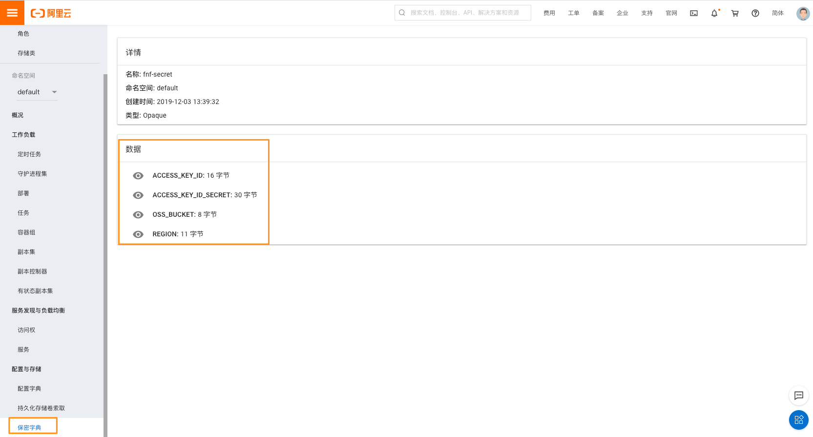
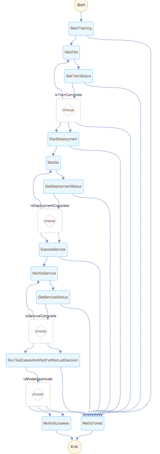

## 介绍
本示例使用阿里云函数计算（FC）和函数工作流 （FnF）搭建 Serverless 机器学习自动化构建，训练，审批流水线。简化机器学习自动化运维 (MLOps)。本示例使用 Tensorflow 在阿里云 K8s 集群上做模型训练和预测服务。
1. 使用函数计算 (FC) golang 函数访问阿里云容器服务 K8s apiserver
2. 使用函数工作流 (FnF) 编排函数计算 (FC) 去调度 K8s 中运行的任务和部署。
3. 使用 FnF 回调功能实现对模型质量的人工审批

## 第一步：准备工作
注意：本示例假设所有资源均在 `cn-hangzhou` 区域：
1. 一个阿里云对象存储 （OSS）bucket 用来存放模型
2. Train/Serving 镜像仓库：在[容器镜像控制台](https://cr.console.aliyun.com/) 创建
    * 命名空间 fnf-demo，在该命名空间下创建两个镜像仓库：
        * 镜像仓库：fnf-fc-serving-tensorflow-demo
        * 镜像仓库：fnf-fc-training-tensorflow-demo
3. 下载安装 [funcraft 工具](https://github.com/alibaba/funcraft)
4. 下载安装 [aliyun cli 工具](https://help.aliyun.com/document_detail/121541.html)
5. 在容器服务 K8s 集群创建保密字典用来存放 AK 等信息


## 第二步：编译部署
使用下面的命令构建 FnF, FC 以及 training/serving 需要的 Docker images

```bash
REGION=cn-hangzhou ACCOUNT_ID={your-main-account-id} VERSION=v1 NAMESPACE={your-image-repo-username} bash ./setup.sh
```

在[函数工作流控制台](https://fnf.console.aliyun.com/fnf/cn-hangzhou/flows/item/fnfDemoMLPipelineFlow) 可以看到下面流程：



## 第三步：开始流程
在[函数工作流控制台](https://fnf.console.aliyun.com/fnf/cn-hangzhou/flows/item/fnfDemoMLPipelineFlow) 开始流程，使用下面的 json 作为 input, 替换：
* {your-training-image}: 如 registry.cn-hangzhou.aliyuncs.com/fnf-demo/fnf-fc-training-tensorflow-demo:v1
* {your-serving-image}: 如 registry.cn-hangzhou.aliyuncs.com/fnf-demo/fnf-fc-serving-tensorflow-demo:v1
* {your-bucket-name}: 存放模型的 OSS bucket 名字，如 fnf-demo-bucket
* {version}: 镜像版本，如 v1
* {your-k8s-cluster-ID}：k8s 集群 ID，可从容器服务控制台获取，如 cabcdefgee4fc4a17855ehijklmn

```
{
  "action": "train-model",
  "demoVersion": "{version}",
  "trainJobNamePrefix": "tf-train-model",
  "trainImage": "{your-training-image}",
  "deploymentNamePrefix": "tf-deployment",
  "servingImage": "{your-serving-image}",
  "serviceNamePrefix": "tf-service",
  "ossBucket": "{your-bucket-name}",
  "k8sClusterID": "{your-k8s-cluster-ID}"
}
```

## 附录
* 阿里云容器服务登录

```
# 获取临时 authorizationToken
aliyun cr GET /tokens --endpoint cr.cn-hangzhou.aliyuncs.com
docker login registry.cn-hangzhou.aliyuncs.com --username fnf-demo
```
